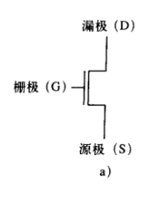
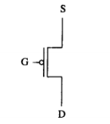
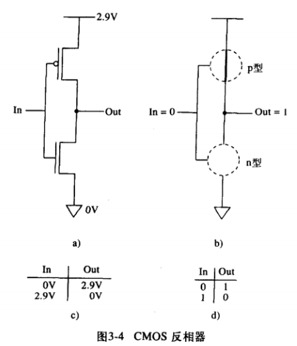
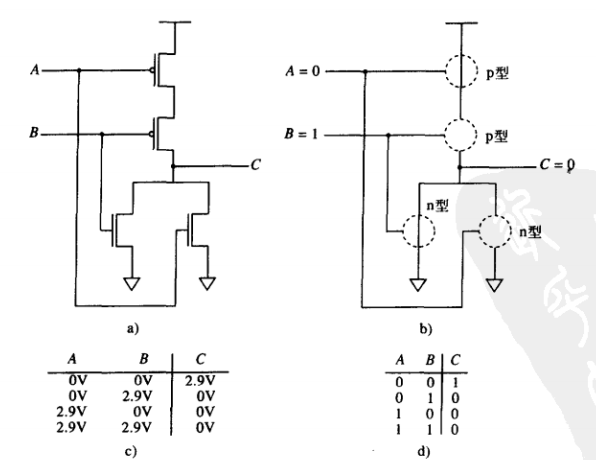
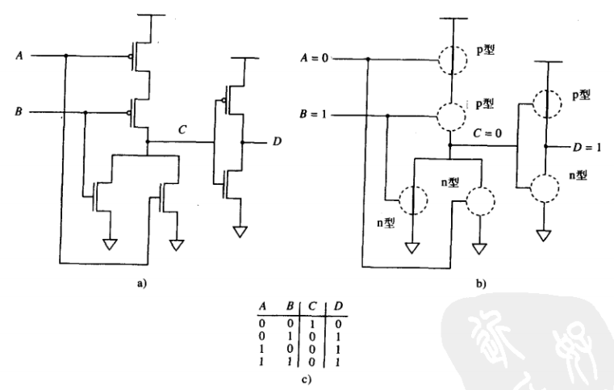
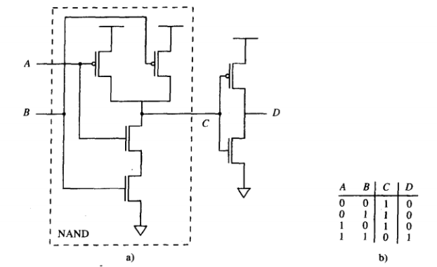
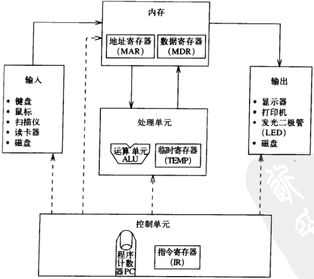
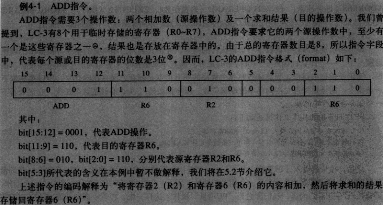

# 《计算机系统概论（第2版）》 笔记

## 2 bit 数据类型及其运算
> 在计算机内, 有符号数有3种表示法: 符号位表示法/反码/补码

### 2.3 补码
以 `5-bit` 为例, 能够表示的范围为 `-16~15`, 共 `32` 个数值


在三种编码方式中正整数的计算结果相同, 但是只有补码在进行包含负数的运算时返回正确的结果

- 5+6=11
```
00110
00101
-----
01011
```

- 5-5=0
```
00101
11011
-----
00000
```

## 2.5.3 溢出
> 正整数相加, 如果符号位为负, 则计算结果溢出; 反之负数相加 ...
- 9+11
```
01001
01011
-----
10100
```

- -12-6
```
10100
11010
```

## 2.6 bit 逻辑运算

### 2.6.1 AND
```
01001
01011
-----
01001
```

### 2.6.2 OR
```
01001
01011
-----
01011
```

### 2.6.3 NOT
> 非 是一元运算符, 在每一位上取反

```
01001
-----
10110
```

### 2.6.4 XOR
> 亦或 在值不同的情况下返回 `1`

```
01001
01011
-----
00010
```

## 2.7 其他类型

### 2.7.2 浮点数
`32-bit float` 类型各位定义如下


- 符号 `1bit`
- 数值范围(指数) `8bit`
- 数值精度 `18bit`

***example-1***  
用 IEEE 浮点数表示 

1. 先转为二进制数

 = -(1x2^2 + 1x2^1 + 0x2^0 + 1x2-1 + 0x2^2 + 1x2-3) => `-110/101`

2. 正则化处理

=> `-1.01101x2^2`

3. 转换为 `float`


## 3. 数字逻辑
> 计算机由大量简单的逻辑单元组成, 大多数微处理器都是由 [`MOS`][2] 构建而成

### 3.1 MOS 晶体管
> 同时包含 `n-MOS` 和 `p-MOS` 晶体管的电路称为 [`CMOS`][3] 电路

#### 3.1.1 `n-MOS` 管
如果栅极加 `2.9v` 电压, 则形成通路


#### 3.1.2 `p-MOS` 管
与 `n-MOS` 相反, 栅极电压为 `0v` 时形成通路


### 3.2 逻辑门
- 非门(此时 `p-MOS` 为通导状态， `n-MOS` 断)  

- 或非门  

- 或门  

- 与门  


## 3.5 内存
> 内存是由一定数量的 **"位置"** 组成, 每个 **"位置"** 可以被单独识别并单独存放一个数据  
> 通常将这样的 **"位置标识符"** 称为地址  

## 3.5.1 寻址空间
内存中可独立识别的位置总数为 `寻址空间`; 如 16M 内存指的是该内存包含 `16777216` 个可独立识别的内存位置

## 3.5.2
> 每个 "位置" 存储的 `bit` 数称为 **`寻址能力` **  
> 大多数内存都是字节寻址的, 计算机在数据处理或接收键盘输入值的时候将其转换为 `8 bit` 的 `ASCII` 码

## 4. 冯 诺依曼模型
冯 诺依曼模型描述了一个简单的计算机模型, 是基于决策单元和存储单元的更高层次的抽象;



### 4.1.1 内存
- read
    1. 将被访问内存单元的地址存入内存地址寄存器 `Memory Address Register(MAR)`
    2. 发送读信号通知内存
    3. 内存将数据存入内存数据寄存器 `Memory Data Register(MDR)`
- write
    1. 将被访问的内存地址存入 `MAR`
    2. 将要写入的数据存入 `MDR`
    3. 发送写信号通知内存

### 4.1.2 处理单元
处理单元是信息真正被处理的地方, 包含多个功能单元(AND/OR/NOT), `ALU` 是最简单的功能单元；

`ALU` 所能处理的量化大小通常成为计算机的字长(`word length`), PC 的字长通常为 `32bit/64bit`

在 `ALU` 附近会会有少量临时寄存器用于存储中间计算结果

### 4.1.4 控制单元
- **指令寄存器**: `IR` 正在执行的指令
- **PC 寄存器**: 更合适的名称为 `指令指针`, 它指向下一条待处理指令的地址

### 4.3.1 指令


### 4.3.2 指令周期
> 指令处理过程是在控制单元的控制下一步步完成的

1. 取出指令
    1. 将 PC寄存器 内容存入 `MAR`
    2. 改地址对应的内存单元内容存入 `MDR`
    3. 控制单元将内容存入 `IR`
2. 译码: 确定指令的类型 `IR[15:12]`; 基于 `16` 中不同的指令, 剩余 `12 bit` 的含义也有所不同
3. 地址计算: 如果存在则执行此节拍
4. 取操作数
5. 执行
6. 存放结果

## 5. LC-3 结构 [note](https://blog.csdn.net/qianxuecheng27/article/details/53368147)
> `ISA` 定义了软件编程所需要的必要而完整的描述  

`ISA` 包含三个部分:  
    - 操作码的集合
    - 数据类型
    - 寻址模式

指令分为三类:
    - 运算, 只支持 `ADD/AND/NOT`
    - 数据搬迁
    - 控制

### 5.1.5 数据类型
`ISA` 只支持 `补码整数` 数据类型

### 5.1.7 条件码
`LC-3` 具有三个位寄存器, 分别为 `N 负数 Z 零 P 正数` 当 `8` 个通用寄存器中任意一个被修改或写入时就会发生变化

### 5.3 数据迁移指令
- 数据从内存移入寄存器为 `load`
- 数据从寄存器移入内存为 `store`


## 附1 相关名词
1. `ALU` 算数逻辑运算单元
2. `MOS` 金属氧化物半导体
3. `CMOS` 互补金属氧化物半导体
4. `MAR` 内存地址寄存器 `Memory Address Register(MAR)`
5. `MDR` 内存数据寄存器 `Memory Data Register(MDR)`
6. `IR` 指令寄存器
7. `ISA` 指令集架构 Instruction Set Architecture
8. `LC-3` Little Computer 3
9. `GPR` 通用寄存器

## 附2 links
- [csdn note](https://me.csdn.net/qianxuecheng27)