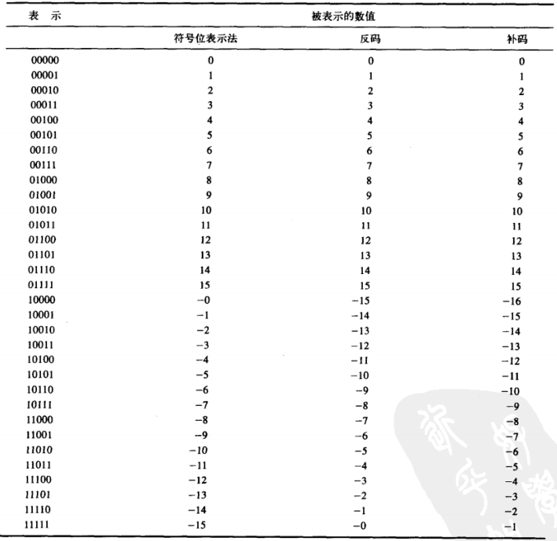
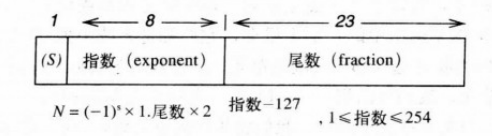
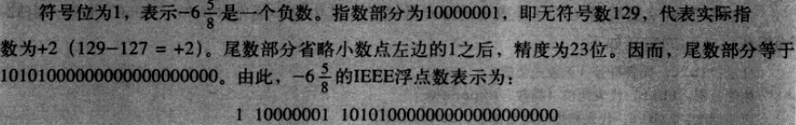

# 《计算机系统概论（第2版）》 笔记

## 2 bit 数据类型及其运算
> 在计算机内, 有符号数有3种表示法: 符号位表示法/反码/补码
### 相关名词
- `ALU` 算数逻辑运算单元

### 2.3 补码
以 `5-bit` 为例, 能够表示的范围为 `-16~15`, 共 `32` 个数值



在三种编码方式中正整数的计算结果相同, 但是只有补码在进行包含负数的运算时返回正确的结果

- 5+6=11
```
00110
00101
-----
01011
```

- 5-5=0
```
00101
11011
-----
00000
```

## 2.5.3 溢出
> 正整数相加, 如果符号位为负, 则计算结果溢出; 反之负数相加 ...
- 9+11
```
01001
01011
-----
10100
```

- -12-6
```
10100
11010
```

## 2.6 bit 逻辑运算

### 2.6.1 AND
```
01001
01011
-----
01001
```

### 2.6.2 OR
```
01001
01011
-----
01011
```

### 2.6.3 NOT
> 非 是一元运算符, 在每一位上取反

```
01001
-----
10110
```

### 2.6.4 XOR
> 亦或 在值不同的情况下返回 `1`

```
01001
01011
-----
00010
```

## 2.7 其他类型

### 2.7.2 浮点数
`32-bit float` 类型各位定义如下



- 符号 `1bit`
- 数值范围(指数) `8bit`
- 数值精度 `18bit`

***example-1***  
用 IEEE 浮点数表示 

1. 先转为二进制数

 = -(1x2^2 + 1x2^1 + 0x2^0 + 1x2-1 + 0x2^2 + 1x2-3) => `-110/101`

2. 正则化处理

=> `-1.01101x2^2`

3. 转换为 `float`



