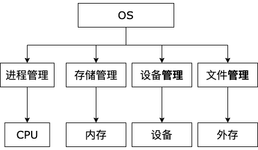

# 计算机操作系统 MOOC
> [课程](https://www.icourse163.org/course/UESTC-1205790811)来自电子科技大学

## 课程框架
1. overview
2. Process and schebuling *进程调度*
3. Memory management *存储管理*
4. Device management
5. File management

## refer
- [课程入口](https://www.icourse163.org/course/UESTC-1205790811)

