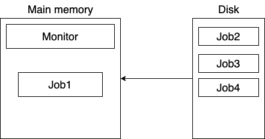
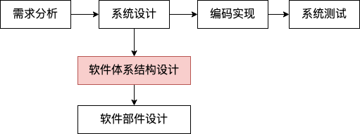
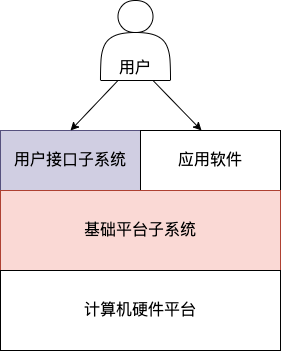

# 绪论

## 面向的用户
- Operating System Designer *操作系统设计者*: 面向操作系统 **硬件**
- Programmer *程序员*: 面向 **操作系统** 和 **开发框架**
- End User *终端用户*: 面向应用程序

## 对于 OS 的不同视角
- 从外部看
    - 计算机用户: 提供了用户的使用环境
    - 应用程序员: 提供了虚拟机 *虚拟机指虚拟化出了硬件本身没有的功能*
- 从内部看
    - OS 开发者: 资源管理视角
    - OS 开发者: 组织作业视角

## 需求分析

## 软件系统的功能型需求
- 计算机用户使用的 `Interface` **用户接口**
    - 表现形式
        - 字符形式
        - 菜单形式
        - 图形形式
    - 使用方式
        - `on-line`
        - `off-line`
- 应用软件需要的 `System Call` **系统调用**
    - `POSIX.1`
    - `WIN32 API`

## 操作系统的非功能性需求
- `Performance` or `Efficiencey`: 性能或效率
- `Fairness`: 公平性
- `Reliability`: 可靠性
- `Security`: 安全性
- `Scalability`: 可伸缩(配置)性
- `Extensibility`: 可扩展性
- `Portability`: 可移植性

## 操作系统对硬件平台的依赖
- `Timer`: 计数器
- `I/O Interrupts`: 中断机制
- `DMA`: 直接存储器访问, [关于 DMA](https://www.zhihu.com/topic/20097181/intro)
- `Privileged Instructions`: 特权指令
- `Memory Protection Mechanism`: 内存保护机制, ***如地址越界 / 频繁的内存地址转换***

## 基本概念
- `Thread`: 线程是系统调度的最小单位
- `Process`: 进程是系统中拥有资源的最小实体
- `Virtual Memory`: 虚拟存储是系统对 `OS` 多级物理存储体系的高度抽象的结果, ***如将外存空间虚拟为内存***
- `File`: 是系统对多种外设进行高度抽象的结果, ***如将打印机虚拟为文件***

## 发展
> 省略了最初的单一操作员、单一控制端系统, 参考自 ***计算机的心智系统与哲学原理***

### 单道程序设计(简单批处理系统)

- 以上模型只允许一个 `job` 在内存
- `Main Memory` 表示内存
- 内存中的 `job1` 独占所有(剩余)内存
- `monitor` 是操作系统, **常驻内存**, 在当前 `job` 完成后再从外存选择 `job` 进入内存

`job` 中可能包含**计算** / **通讯** / **I/O** 等任务; `CPU` 运行远快于 `I/O`, 但是又必须等待 `I/O` 的结果, 实际上有很多时间 `CPU` 是处于等待状态, 且 `job1` 依然占用资源

### 多道程序设计
允许多道程序同时准备运行, 当前程序因为某种原因(如等待 `I/O`)无法运行时, 将启动下一道程序运行, 这道程序会在将来重新运行;

带来的问题:

**同步**: 大多数情况下程序之间是需要同步(协调)的, `Process A` 向文件写入数据, `Process B` 读取数据, 这时就需要有一种机制可以让 `Process A` 进程告知 `Process B` 写入数据的情况
**互斥**: 多个进程同时读写文件的, `OS` 已有机制
**确定性**: 进程不管与任何进程同时运行其结果都应该是一致的
**死锁**: 多个进程争夺同一个资源

### 分时系统
对每个 `job` 按时间分配, 到时间后 **中断**, 切换到下一个 `job`

## 多道系统与分时系统的对比

OS | 目标 | 指令
--- |--- |---
`Batch Multiprogramming` | 尽可能提高 `CPU` 利用率 | 作业控制语言
`Time sharing` | 尽可能降低响应时间 | `terminal`

## OS 的基本特征
- 任务并行:
    - 并发: 多个任务在单个处理机上交替运行
    - 并行: 多个任务在多个处理机上同时运行
- 资源共享: 多个任务可以交替互斥的使用某个资源

## 任务管理模型

OS | 基本表示单位 | 管理模型
--- |--- |---
现代操作系统 | **线程** / **进程** | 线程状态转换图
传统操作系统 | **进程** | 进程状态转换图

## 资源管理模型

- 软件资源: 程序 / 数据 
- 硬件资源: `CPU` / 存储器 / `I/O` 设备

- 对于软件资源, `OS` 使用竞争模式管理软件资源, 为此提供了 **互斥机制**
- 对于硬件资源, 使用 **分配模式** 进行管理

## 软件体系结构设计

一种常见的 `OS` 总体结构风格:

### 用户接口子系统
如 `shell`

### 基础平台子系统结构风格
!> 其中 `Mode` 模式是指程序在运行过程中使用的由硬件体系结构提供的 `CPU` 特权模式

#### 分层结构风格
`Layered Structural Style` 风格中的各层不依赖上层, 只依赖 ***直接下层*** 所提供的概念及属性, 每一层都对上层隐藏其下层的存在

#### 分级结构风格
`Hierarchical Structural Style` 风格中的各层不依赖上级, 只依赖 ***所有下级*** 所提供的概念及属性

#### 分块结构风格
`Modular Structural Style` 风格中的各块 ***均可依赖任意模块*** 提供的概念及属性

#### 多模式结构风格
包含一个 ***模式模块***, 系统安全性低, 但运行效率高

#### 多模式结构风格
包含多个 ***模式模块***, 不同的模块在不同的 `CPU` 特权模式下运行, 有利于系统的稳定性

## refer
- [1_2_01绪论](https://www.icourse163.org/learn/UESTC-1205790811?tid=1452082460#/learn/content?type=detail&id=1220309371&sm=1)
- [关于 DMA](https://www.zhihu.com/topic/20097181/intro)