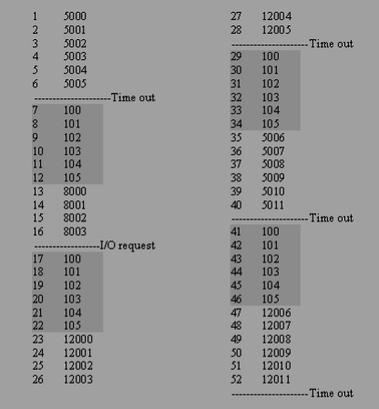

# 2-1 进程描述与控制
**进程** 是程序在一个数据集合上的运行过程, 是系统进行资源分配和调度的独立单位

## 构成
- 程序
- 数据
- PCB: `Process Control Block` *[进程控制块](https://www.jianshu.com/p/3f5ad390433f), 其中包含了进程情况和控制进程执行的重要信息*

## 并发
?> 程序的并发执行条件: `R(P1)∩W(P2)∪W(P1)∩R(P2)∪W(P1)∩R(P2) = {}`  
两个进程满足上述表达式即只允许 ***同时*** 读数据, 不允许同时写或一个读一个写的情况时才能保证这两个程序互不影响  
在数据库软件中表现为 **事务**

> 这里的 **同时** 的概念(`R(P1)∩W(P2)`)表现为进程 A 正在读, 此时发生中断, 切换到进程 B 写, 再回到进程 A, 此时进程 A 读到的数据可能就不是最新数据了

- 程序在顺序执行时的特征是:
    - 顺序性
    - 封闭性, *独占某个封闭的内存空间*
    - 可复现性, *对于某个输入, 有确定不变的输出*
- 程序在 **并发** 执行时的特征是:
    - 间断, *与其他程序交替执行*
    - 非封闭性, *可能会受到其他程序的影响*
    - 不可复现性

## 进程执行过程 example

- `Dispatcher`, 分派程序负责程序调度, 常驻内存
- `Process Counter`, 记录当前执行到了那个进程的哪条 **指令**

- `Time out`, 表示超过当前程序允许的执行时间, *即分时系统中的中断*
- `I/O request`, 表示等待 `I/O`, 此时也会中断
- 每次中断后都会执行调度程序
- 其中包含了:
    - 模式的切换
    - 进程的中断
    - 进程的切换

## 进程状态

- `New`: 进程已创建, 但未被 `OS` 接纳为可执行进程
- `Ready`: 准备执行
- `Running`: 执行
- `Block`: 等待某事件发生才会继续执行
- `Exit`: 因停止或取消, 被 `OS` 从执行状态释放

## Swaping

将系统中暂时不用的进程(阻塞), `Swaping-out` 到外存, 以腾出足够的内存空间, 此时进程的状态为 **挂起状态**; 把已经具备运行条件的进程 `Swaping-in` 到内存

### 挂起状态 Suspend
- 使之挂起的进程: `OS` / 父进程 / 自身
- 使之有挂起状态转换为其他状态: **使之挂起的进程**

