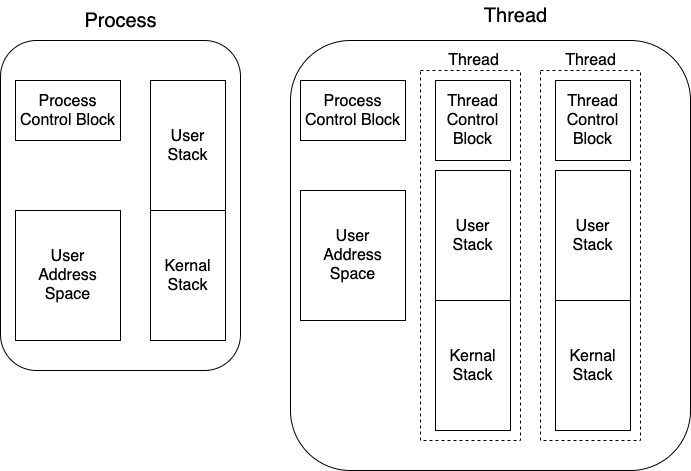

# 线程

线程由进程派生(`spawn`) 而来

- 也有状态 `state`
- 被中断时也会保存上下文 `context`
- 拥有自己的执行堆栈 `execution stack`
- 拥有自己的局部变量 `local variables` & 静态存储 `static storage`
- 线程分为两类:
    - `user level thread` 用户线程
        - 从 `kernal` 角度看并不知道有用户线程存在, 所以 **`TCP` 并不会保存到内存**
        - 用户线程及其数据结构和原语在 [核外子系统](./overview.md#双模式基础平台子系统) `User Mode` 中实现
    - `kernal level thread` 操作系统线程
        - 有操作系统内核来维护数据结构
        - 用户线程及其数据结构和原语在 [核心子系统](./overview.md#双模式基础平台子系统) `Kernal Mode` 中实现

## 与进程的区别
进程是资源的分配单位, 线程是调度单位; 创建进程时为进程分配资源, 进程调度线程去完成每个任务, 所有线程共享了进程的资源;

## 线程的优点
- *创建线程* 比创建进程消耗的时间短
- *终止线程* 比终止进程消耗的时间短
- *切换同进程中的线程* 比切换进程开销要小

