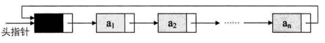

# 2-线性表

零个或多个数据元素的有限序列

## 2-1 存储结构

### 2-1-1 顺序存储结构
用一段地址连续的存储单元依次存储数据元素

```c
# define MAXSIZE 20;

typedef int ElemType;

typedef struct SqList {
    ElemType data[MAXSIZE];
    int length;
};
```


优点:
- 无需为表示元素间的逻辑关系增加额外的存储空间
- 可以快速存取表中的任意元素

缺点:
- 插入和删除需要移动大量元素
- 线性表长度变化较大时, 难以确定存储空间容量
- 容易造成存储空间的碎片


### 2-1-2 链式存储结构

#### 单链表
头结点可以存储公共数据

```c
typedef int ElemType;

typedef struct Node {
    ElemType data;
    struct Node *next;
} Node;

typedef struct Node *LinkList;
```


#### 循环链表



#### 双向链表

```c
typedef int ElemType;

typedef struct DulNode {
    ElemType data;
    struct Node *prior; // 前驱指针
    struct Node *next; // 后继指针
} DulNode, *DulNodeList;
```


### 总结
- 需要频繁查找, 且很少进行插入或删除时应该使用顺序存储结构
- 需要频繁插入或删除, 或数据长度不确定时应该使用链式存储结构
