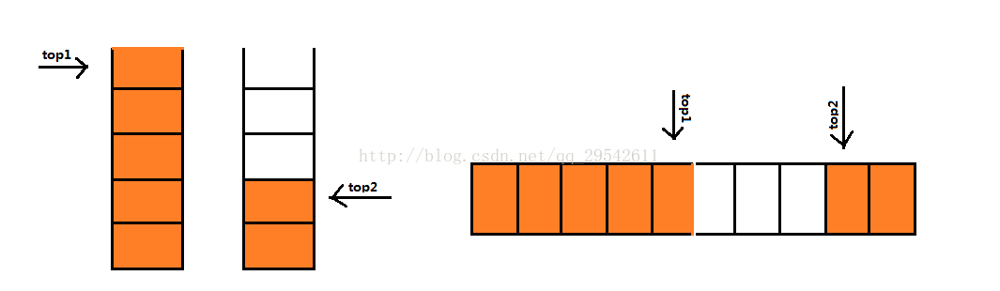
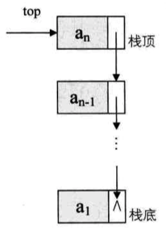

# 3-栈和队列

## Stack
栈是限定仅在表尾进行插入和删除的线性表

```c
typedef int SElemType; // 每个结点都是 int 类型
typedef struct {
    SElemType data[MAXSIZE];
    int top;    // 指向栈顶的指针
}SqStack;
```

### 两栈共享空间

```c
typedef int SElemType; // 每个结点都是 int 类型
typedef struct SqStack {
    SElemType data[MAXSIZE];
    int top1;    // 指向栈1 的栈顶指针
    int top2;    // 指向栈2 的栈顶指针
};
```



## 链栈

```c
typedef struct StackNode {
    SElemType data;
    struct StackNode *next;
} StackNode, *LinkStackPtr;

typedef struct LinkStack {
    LinkStackPtr top;
    int count;    
} LinkStack;
```



## Stack 的应用
### 递归
对于每一层递归, 函数的局部变量 / 参数 / 返回地址都被压入栈中并在退回阶段依次弹出

### 四则运算表达式求值

前缀表达式:

```bash
9+(3-1)*3+10/2
```

中缀表达式:

```bash
9 3 1 - 3 *+ 10 2 / +
```

前缀表达式转换为中缀表达式: [参考文章](https://segmentfault.com/a/1190000007790883?utm_source=debugrun&utm_medium=referral)

## Queue
队列是只允许在一段进行插入, 另一端进行移除的线性表


### 循环队列

```c
typedef int SElemType; // 每个结点都是 int 类型
typedef struct SqQueue{
    SElemType data[MAXSIZE];
    int front;   // 指向队头的指针
    int rear;    // 指向队列元素的下一个位置
};
```


### 链队列

```c
typedef int SElemType;

typedef struct QueueNode {
    SElemType data;
    struct QueueNode *next;
} QueueNode, *LinkQueuePtr;

typedef struct LinkQueue {
    LinkQueuePtr front, rear;
} LinkQueue;
```

