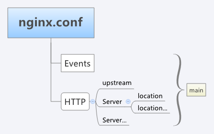

# nginx 笔记

## Install
?> 下文中的 `nginx` 直接使用 `brew` 安装, 编译安装参考 **[官方文档](http://nginx.org/en/docs/configure.html)** 的 **[configure 配置](http://nginx.org/en/docs/configure.html)**

## 配置

### 配置文件结构
配置块 | 配置内容 | 继承关系
--- |--- |---
`main` | 是全局设置 | _
`server` | 指定网站配置 | 继承 `main`
`location` | 设置网站具体配置 | 继承 `server`
`upstream` | 设置负载均衡 | _



### nginx.conf
?> 🔧 表示需要自定义, 系统资源使用数量可以通过 `ulimit` 命令修改和获取

可以通过 `nginx -t` 查看配置文件路径

```nginx
# 使用默认用户 nobody
user                nobody;
# 🔧 worker 进程数, 与 CPU 数量一致即可
worker_processes    6;

# 错误日志路径, 可选 debug / info / notice / warn / error / erit, debug 最详细, erit 最少
error_log       /usr/local/nginx/logs/error.log info;
# 进程标识符存放路径
# pid           logs/nginx.pid;

# 🔧 进程可以打开的最大描述符数量, 使用 `ulimit -a` 查看对应的参数; 同样的, 修改资源使用参数也可以使用 `ulimit` 命令修改
worker_rlimit_nofile 256;

events {
    # 🔧 I/O 模型; BSD 用 kqueue; Linux 用 epoll
    use kqueue;
    # 每个 worker 进程的最大连接数, 默认 1024
    worker_connections
}

http {
    include       mime.types;
    # 当请求未知类型的文件时的返回类型
    default_type  application/octet-stream;

    # 日志格式设置。
    # $remote_addr与$http_x_forwarded_for用以记录客户端的ip地址；
    # $remote_user：用来记录客户端用户名称；
    # $time_local： 用来记录访问时间与时区；
    # $request： 用来记录请求的url与http协议；
    # $status： 用来记录请求状态；成功是200，
    # $body_bytes_sent ：记录发送给客户端文件主体内容大小；
    # $http_referer：用来记录从那个页面链接访问过来的；
    # $http_user_agent：记录客户浏览器的相关信息；
    # 通常web服务器放在反向代理的后面，这样就不能获取到客户的IP地址了，通过$remote_add拿到的IP地址是反向代理服务器的iP地址。
    # 反向代理服务器在转发请求的http头信息中，可以增加x_forwarded_for信息，用以记录原有客户端的IP地址和原来客户端的请求的服务器地址。
    log_format  main  '$remote_addr - $remote_user [$time_local] "$request" '
                      '$status $body_bytes_sent "$http_referer" '
                      '"$http_user_agent" "$http_x_forwarded_for"';

    # 高性能文件传输模式, 在代理静态资源时可提高性能
    sendfile            on;
    tcp_nopush          on;
    tcp_nodelay         off;

    directio            4m;
    directio_alignment  512;

    keepalive_timeout       180s;
    keepalive_requests      100;
    keepalive_disable       msie6;
    send_timeout            60s;
    client_body_timeout     60s;
    client_header_timeout   30s;

    # 开启 gzip 模块, 参考[官网配置](http://nginx.org/en/docs/http/ngx_http_gzip_module.html)
    gzip                    on;
    gzip_min_length         1024;
    gzip_buffers            4 16k;
    gzip_comp_level         5;
    gzip_proxied            any;
    gzip_types              text/plain application/json application/x-javascript text/css appl ication/xml;
    gzip_vary               on;
    gzip_disable            "MSIE [1-6]\.";

    fastcgi_buffer_size             64k;
    fastcgi_buffers                 4 64k;
    fastcgi_busy_buffers_size       128k;
    fastcgi_temp_file_write_size    256k;
    fastcgi_connect_timeout         300;
    fastcgi_send_timeout            300;
    fastcgi_read_timeout            300;

    # 引入所有虚拟主机配置
    include servers/*.conf;
}

```

### servers/test-php.conf

```bash
# 使用 sock 连接时新建 sock 文件, 注意要在赋予 nobody 用户权限
sudo touch /var/log/php/php-fpm.sock
```

`/private/etc/php-fpm.d/www.conf`

```conf
; The address on which to accept FastCGI requests.
; Valid syntaxes are:
;   'ip.add.re.ss:port'    - to listen on a TCP socket to a specific IPv4 address on
;                            a specific port;
;   '[ip:6:addr:ess]:port' - to listen on a TCP socket to a specific IPv6 address on
;                            a specific port;
;   'port'                 - to listen on a TCP socket to all addresses
;                            (IPv6 and IPv4-mapped) on a specific port;
;   '/path/to/unix/socket' - to listen on a unix socket.
; Note: This value is mandatory.
listen = /var/log/php/php-fpm.sock
```

```profile
server {
    listen              80;
    server_name         test-php.com;
    index               index.php index.html; # 默认可以访问的页面,按照写入的先后顺序去寻找
    root                /Users/sven/projects/test_php; # 项目根目录

    # 防止访问版本控制内容
    location ~ .*.(svn|git|cvs) {
        deny all;
    }

    # 此处不是必须的,需要时候配置
    # location / {
        # Laravel 5.4 Url 重写
    #    try_files $uri $uri/ /index.php?$query_string;
    # }


    # 下面是所有关于 PHP 的请求都转给 php-fpm 去处理
    location ~ \.php {
        # 注意： unix sock 和 ip ，两种方式只能选择一种

        # 基于unix sock 访问, Ubuntu Apt 方式安装的PHP默认是以sock方式启动
        # 只有 nginx 和 php-fpm 在同一台服务器时才能用 sock 方式
        # 此处的 sock 路径应该与上面的 `/private/etc/php-fpm.d/www.conf` listen 一致
        fastcgi_pass            unix:/var/log/php/php-fpm.sock;

        # 基于IP访问
        # fastcgi_pass    127.0.0.1:9000;

        fastcgi_split_path_info ^(.+\.php)(.*)$;
        fastcgi_param           PATH_INFO $fastcgi_path_info;
        fastcgi_param           PATH_TRANSLATED $document_root$fastcgi_path_info;
        fastcgi_param           SCRIPT_FILENAME $document_root$fastcgi_script_name;
        include                 fastcgi_params;
    }

    fastcgi_intercept_errors on;
    # 日志保存目录,一般按照项目单独保存, 开发环境可以关闭
    # access_log logs/test-php.log access; 
    # access_log on;
}
```

## 常用命令
```bash
sudo nginx -t
sudo nginx -s reload
```

## 错误处理
- 错误信息: `nginx: [error] invalid PID number "" in "/var/log/nginx/nginx.pid"`
- 环境: all
- 原因: 需要先制定配置文件再启动(首先要赋予 `pid` 文件权限)

```bash
sudo nginx -c /usr/local/etc/nginx/nginx.conf
```

## 静态资源代理
```nginx
server {
    listen              10002;
    server_name         192.168.0.28;
    access_log          /var/log/nginx/videos-access.log;
    error_log           /var/log/nginx/videos-error.log;
    index index.html    index.htm;
    error_page 404      /404.html;
    charset             utf-8;

    location / {
        autoindex       on;
        expires         off;
        root            /Users/sven/projects/video_list;
    }
}
```

## 设置 Nodejs 反向代理

代理本地 `8001` 端口及 `静态资源目录`
```nginx
server {
	listen 		80;
	server_name test-node.com;
	root		/home/xxx/projects/koa-demo/static;
	index		index.html index.htm;
    charset     utf-8;

	location ~ .*\.(gif|jpg|jpeg|png|bmp|swf|js|css|ico|html|htm)$ { 
		root    /home/xxx/projects/koa-demo/static;
		# expires 3d;
	}

	location / {
		proxy_set_header X-Real-IP $remote_addr;
		proxy_set_header X-Forwarded-For $proxy_add_x_forwarded_for;
		proxy_set_header Host  $http_host;
		proxy_set_header X-Nginx-Proxy true;
		proxy_set_header Connection "";
		proxy_pass       http://127.0.0.1:8001;
	}
}
```

## refer
- [配置详解 1](https://www.jianshu.com/p/5d6bd48b4c2f)
- [配置详解 2](https://blog.csdn.net/wangbin_0729/article/details/82109693)